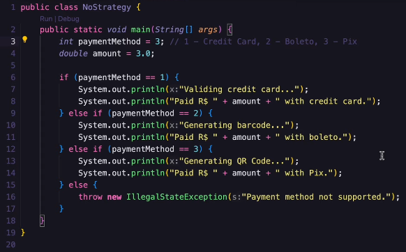
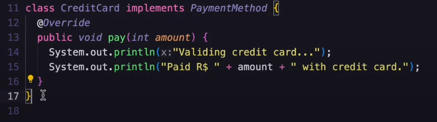
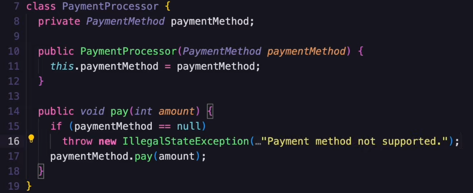
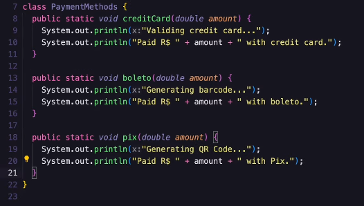
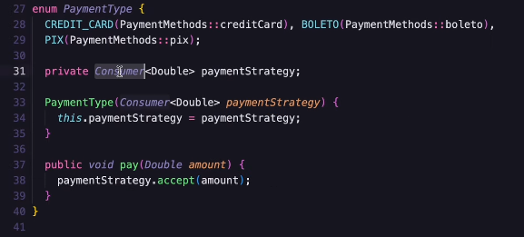
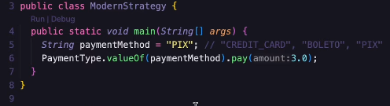

# About

Study about Design Pattern, in this case, the Strategy Pattern.

[Giuliana Bezerra Video](https://www.youtube.com/watch?v=-h14L7LzqYc)

## Introduction

Imagine a payment system. We are going to have a lot of payment methods, right? Credit cards, Boleto, Pix and others.

Generally speaking, we instantly think about making a system with if's and else's to meet the criteria, right? 

This is basically work without a strategy pattern. ⬇️ 

## No Strategy

But this is not the ideal thing to do. Too many conditions can "f" the system logic.

It's hard to maintain a system with too many conditionals. Also, remember: everytime we add a new payment
method, we would need to make another condition, and that is not optimal.

Likewise, adding conditionals like this we stop working with SOLID.

### Briefly remembering SOLID

**❗Remember, SOLID: Open-Closed, software entities should be open for extension but closed for modification.**

If we need to modify our code directly, he is NOT extended! Modifications can break the code.

So, we need to use a strategy, in this case we are going to study the Strategy. ⬇️

## Types of strategies

We are going to see the common one, a modern one and compare the approaches.

## Strategy definition

This pattern allow us to define a family of algorithms, encapsulate them and make them interchangeable dynamically.

**Family of algorithms = the conditions (if's and else's).**

It's basically the SAME thing in the "if else", but this approach is an extensible one.

So, instead of making a hard code payment logic, we can delegate different strategies that can be used dynamically (
depending on the context, like pix, boleto or credit card). 

Let's now look at the following strategy, a common one. ⬇️

## Common Strategy

The first thing we need to do is use the abstract concept. Instead of using if's and else's, we can "plug" an interface
that's going to REPRESENT a payment method.

You can either insert on the class (Service) itself, or create separately.

The interface itself can have a method (a void one), named "pay". We don't know the payment method, right? So we are
going to receive a number on the parameter.

**And we need to also create a class for each payment method, implementing the interface.**

Imagine we created a CreditCard class, we implement the interface and the method. Inside of it, we can create the payment
logic for the credit card system.

Now, to use the strategy, we need to create a class responsible to process the payment. Inside of it, we INJECT the interface.

And we'll have a method "pay" that's going to call the interface method.

We can now use everything, remember: we are simulating the data! The "paymentMethodCode", for example, would be the user's
choice. We can use a switch case to instantiate the class (CreditCard, Boleto or Pix).

With this approach, each payment method deals with its own logic. If we change some code on the CreditCard class, it'll
not affect the other classes.

### The problem with this approach

We are still using conditionals (the switch case). The strategy pattern itself aims to avoid the conditionals.

**❗So, the idea is not to just separate the responsibilities, but also to decrease the complexity.**

Let's use now the Modern Strategy, using ENUMS! ⬇️

## Modern Strategy

This strategy brings: safety, simplicity (since we don't use classes and hierarch, and if's to see the context).

The first thing is, we can create a class with all the PaymentMethods with the logic inside of it:

Now that's the cool part. We can create a ENUM "PaymentMethod", that's going to receive them. Inside the attribute, we
can call the method that we created inside the class (like a property, using lambda), check it out:

❗For this call to work, the method needs to be static.

Not, the "trick" part, read with attention.

Inside the enum we can create a constructor, it'll receive a "Consumer". The consumer type is a functional interface that
receives a value! We can set the type of data that the consumer will receive, and name it.

To use this little guy, we need to create and attribute to save the value. After, we can create the method responsible
for the payment (he's going to use the Consumer).

The "accept" is a method that comes from the Consumer Interface (that receives an amount).

**To emphasize, the type of payment come from the context (front-end).**

And now, if there was a new payment method, we would only insert on the class, and in the ENUM, simple as that.

## Conclusion

We improved the code readability and maintainability.

It's easier to extend with new payment methods (OPEN/CLOSED - SOLID).

We used Variations: Maps, Lambda...

State pattern
